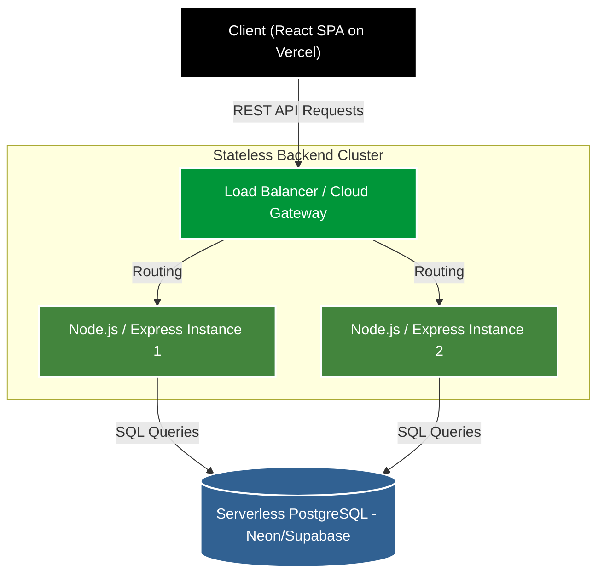

<div align="center">
  
  
  <h1>ShopScale.</h1>
  <p><strong>A Cloud-Native Scalable E-Commerce Platform</strong></p>
  
  <p>
    <a href="https://reactjs.org/"></a>
    <a href="https://nodejs.org/"></a>
    <a href="https://www.postgresql.org/"></a>
    <a href="https://www.docker.com/"></a>
    <a href="https://nginx.org/"></a>
  </p>

  <h3>
    🔴 <a href="https://ecommerce-platform-rdpnp05f1-sis-projects-a5d26c6e.vercel.app/">View Live Demo</a>
  </h3>
</div>

<br />

## 🎯 Project Overview

**ShopScale** is a professional-grade, horizontally scalable e-commerce platform demonstrating modern architectural patterns, stateless backend design, strict race condition handling, and high-performance load balancing. It is completely modernized with a premium "Kinetic Editorial" UI/UX.

---

## 🏗️ Architecture & Technologies

ShopScale is built with a decoupled 4-tier architecture designed for horizontal scalability and high availability.



### Key Engineering Features
1. **Absolute Statelessness**: 
   Handling state (sessions, cart data) across multiple servers is a core challenge. ShopScale achieves this by using stateless JWT authentication and persisting Cart State immediately to PostgreSQL, allowing any backend node in the cluster to service any request.
2. **Race Condition Prevention**: 
   The checkout flow uses strict row-level DB locking (`SELECT ... FOR UPDATE`) to prevent double-selling inventory during simultaneous high-traffic events.

---

## 🎨 Frontend Design: "Kinetic Editorial"

The frontend has been completely overhauled to break away from generic SaaS templates, offering a highly curated consumer experience.

- 🪄 **Micro-Interactions**: Custom CSS-driven hover effects and a global Toast notification system for instantaneous user feedback.
- 🪟 **Glassmorphism**: A sleek, frosted-glass Cart Drawer that keeps the user engaged without jarring page reloads.
- ⚡ **Perceived Performance**: Universal Skeleton loaders replace static loading text, providing a highly premium experience.
- 📊 **System Dashboard**: A custom frontend `/system-status` dashboard that visualizes backend health and API connectivity in real-time.

---

## 🚀 Local Development (Docker)

To run the full architecture locally (Nginx LB + Node instances + React):

1. **Environment Setup**: Populate the database credentials in `backend/.env`. (Use `.env.example` as a template).
   ```env
   DATABASE_URL=your_postgres_db_url
   JWT_SECRET=your_super_secret_key
   PORT=3001
   ```

2. **Database Initialization**: 
   ```bash
   cd backend
   npm install
   npm run migrate
   npm run seed
   ```

3. **Start the Backend Cluster (Docker)**: 
   ```bash
   docker-compose up --build
   ```
   *(The Nginx load balancer is now running on `http://localhost:8080/api/`)*

4. **Run the React Frontend**: 
   ```bash
   cd frontend
   npm install
   npm run dev
   ```
   *(Navigate to `http://localhost:5173`)*

---

## ☁️ Cloud Deployment

The live demo utilizes a modern, decoupled cloud deployment strategy:
- **Frontend**: Hosted globally on **Vercel** (`https://ecommerce-platform-...vercel.app`).
- **Backend API**: Hosted as a scalable Web Service on **Render**.
- **Database**: Serverless PostgreSQL hosted on **Supabase** / **Neon**.

---

## 🔐 Demo Accounts
To explore user and administrative features without creating an account:
- **Admin**: `admin@shopscale.com` / `admin123`
- *Alternatively, you can register a new customer account directly through the UI.*

<div align="center">
  <br/>
  <sub>Built as a cloud computing architectural demonstration.</sub>
</div>
